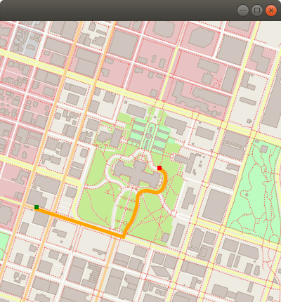

# Route Planning Project

The route planning code create a route in between 2 points from user input with A* serach.
The project is based on the starter code from [here](https://github.com/udacity/CppND-Route-Planning-Project).




## Dependencies 
* cmake >= 3.11.3
  * All OSes: [click here for installation instructions](https://cmake.org/install/)
* make >= 4.1 (Linux, Mac), 3.81 (Windows)
  * Linux: make is installed by default on most Linux distros
  * Mac: [install Xcode command line tools to get make](https://developer.apple.com/xcode/features/)
  * Windows: [Click here for installation instructions](http://gnuwin32.sourceforge.net/packages/make.htm)
* gcc/g++ >= 7.4.0
  * Linux: gcc / g++ is installed by default on most Linux distros
  * Mac: same instructions as make - [install Xcode command line tools](https://developer.apple.com/xcode/features/)
  * Windows: recommend using [MinGW](http://www.mingw.org/)
* IO2D
  * Installation instructions for all operating systems can be found [here](https://github.com/cpp-io2d/P0267_RefImpl/blob/master/BUILDING.md)
  * This library must be built in a place where CMake `find_package` will be able to find it
  * [Note] The enviroment setup on mac turned a little tricky. I did the project with virtual box + ubuntu. Another reference for IO2D install on ubuntu can be found [here](https://gist.github.com/wAuner/68ee426b87d297340826660f5ac62b79).

## Compiling and Running

### Compiling
To compile the project, first, create a `build` directory and change to that directory:
```
mkdir build && cd build
```
From within the `build` directory, then run `cmake` and `make` as follows:
```
cmake ..
make
```
### Running
The executable will be placed in the `build` directory. From within `build`, you can run the project as follows:
```
./OSM_A_star_search
```
Or to specify a map file:
```
./OSM_A_star_search -f ../<your_osm_file.osm>
```

## Testing

The testing executable is also placed in the `build` directory. From within `build`, run the unit tests as follows:
```
./test
```
The test result is as below:


